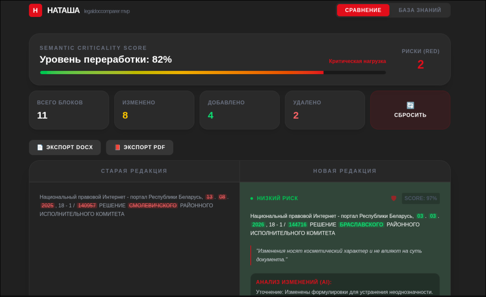
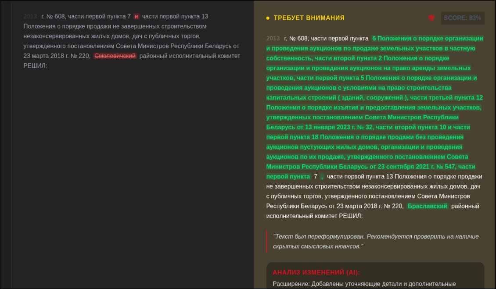
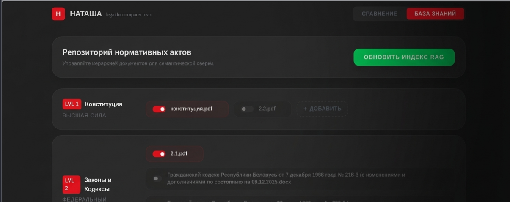

# LegalDocComparer — Система НАТАША

> Интеллектуальный анализатор изменений в юридических документах с многоуровневым объяснением рисков.


---

## 📖 Описание

**LegalDocComparer** — это система автоматического сравнения версий нормативно-правовых актов (НПА) и локальных нормативных актов (ЛНА). Система находит семантически значимые изменения между двумя версиями юридического документа, классифицирует их по уровню риска и генерирует подробный отчёт с объяснением каждого изменения. В отличие от простого diff-инструмента, система понимает русскоязычный юридический язык и учитывает правовую иерархию документов.

## 💡 Как появилась идея


Идея родилась на семинаре по юридической лингвистике, где преподаватель показал: изменение одного предлога в нормативном акте может кардинально менять права сторон. Ручное сравнение двух версий документа занимает часы и требует высокой концентрации, а обычный diff показывает символьную разницу, но не семантическую значимость изменения. Задача казалась идеальной для автоматизации — пока не выяснилось, насколько сложно работать с юридическим русскоязычным текстом и насколько глубокая получается архитектура (семантика + LCS + RAG-иерархия документов).


---

## 🛠 Технологический стек

| Технология | Версия | Для чего используется |
|---|---|---|
| **Python** | 3.11+ | Основной язык бэкенда |
| **FastAPI** | latest | REST API сервер |
| **Uvicorn** | latest | ASGI-сервер |
| **python-docx** | latest | Парсинг `.docx`-файлов |
| **pdfplumber** | latest | Извлечение текста из PDF |
| **Natasha** | latest | Русская морфология и NLP |
| **pymorphy3** | latest | Лемматизация русских слов |
| **RapidFuzz** | latest | Быстрое нечёткое сравнение строк |
| **sentence-transformers** | latest | Векторные эмбеддинги (rubert-tiny2) |
| **scikit-learn** | latest | Косинусное сходство векторов |
| **SQLAlchemy** | latest | ORM для локальной БД (SQLite) |
| **fpdf2** | latest | Генерация PDF-отчётов |
| **pydantic-settings** | latest | Управление конфигурацией |
| **python-multipart** | latest | Загрузка файлов через API |
| **Next.js** | planned | Фронтенд (в разработке) |
| **TypeScript** | planned | Типизация фронтенда |
| **Tailwind CSS** | planned | Стилизация UI |

### Выделенные библиотеки

- **[Natasha](https://natasha.github.io/)** — полноценный NLP-стек для русского языка: сегментация, морфологический разбор, лемматизация. Позволяет сравнивать документы с учётом падежей, спряжений и форм слов, а не только буквальных совпадений.
- **[RapidFuzz](https://github.com/maxbachmann/RapidFuzz)** — на порядок быстрее стандартного `difflib` при нечётком сравнении. Используется для выравнивания блоков, устойчивого к изменению нумерации статей.
- **[sentence-transformers (rubert-tiny2)](https://huggingface.co/cointegrated/rubert-tiny2)** — компактная русскоязычная модель BERT для генерации смысловых эмбеддингов. Позволяет находить семантически близкие нормы в иерархической базе документов.

---

## ✨ Возможности

- **Сравнение документов** — загрузка двух версий нормативного акта (`.docx` или `.pdf`) и автоматическое выравнивание блоков
- **Гибридный алгоритм выравнивания** — сочетает нумерационное совпадение (40%) и лексическую схожесть (60%), устойчив к перенумерации статей
- **Многоуровневый анализ рисков** с тремя уровнями:
  - 🔴 **RED** — критические изменения (изменились ключевые триггеры или семантическое сходство < 0.7)
  - 🟡 **YELLOW** — существенные изменения (сходство 0.7–0.92)
  - 🟢 **GREEN** — редакционные правки (сходство > 0.92)
- **4-слойная объяснимость** каждого изменения: причина выравнивания → тип изменения → выделение слов → человекочитаемый комментарий
- **29 юридических триггеров** — система отслеживает ключевые слова модальности, даты, суммы, отрицания и другие маркеры правовых обязательств
- **Иерархическая база знаний** — 10-уровневая система (от Конституции до локальных актов) для поиска конфликтов с вышестоящими нормами через RAG
- **Умное сворачивание** — группировка длинных последовательностей добавленных блоков без рисков для удобства чтения
- **Экспорт отчётов** — генерация двухколоночных отчётов в DOCX и PDF с цветовой индикацией по уровню риска
- **Управление иерархией** — загрузка, удаление и включение/отключение файлов в базе знаний через API без переиндексации

---

## 🚀 Установка и запуск

### Требования

- Python 3.11+
- Git

### Установка

```bash
# 1. Клонировать репозиторий
git clone https://github.com/Gudi00/ai_BSUIR_sth.git
cd ai_BSUIR_sth

# 2. Создать и активировать виртуальное окружение
python -m venv venv
source venv/bin/activate        # Linux / macOS
# venv\Scripts\activate         # Windows

# 3. Установить зависимости
pip install -r backend/requirements.txt
```

### Запуск бэкенда

```bash
uvicorn backend.app.main:app --host 0.0.0.0 --port 8001 --reload
```

API будет доступен по адресу: `http://localhost:8001`

Интерактивная документация (Swagger UI): `http://localhost:8001/docs`

### Генерация тестовых данных

```bash
python data/generate_mock_data.py
```

### Ключевые эндпоинты API

```bash
# Сравнение двух документов
POST /compare
# Тело: multipart/form-data с полями old_file и new_file

# Загрузка файла в базу знаний (уровень 1-10)
POST /hierarchy/{level}/upload

# Управление файлами базы знаний
GET    /hierarchy
POST   /hierarchy/toggle
DELETE /hierarchy/{level}/{filename}
POST   /hierarchy/reindex

# Экспорт отчётов
POST /export/docx
POST /export/pdf
```


---

## 📸 Скриншоты и демо


*Результаты сравнения — блоки RED/YELLOW/GREEN*


*Детализация изменений с выделением слов*


*Иерархическая база знаний — 10 уровней*

---

## 💼 Как я использую этот проект


Использую как исследовательскую платформу для отслеживания изменений в университетских регламентах БГУИР и пробных документах. Параллельно проект работает как мой практический полигон в области русскоязычного NLP — здесь же отрабатываю работу с Natasha, sentence-transformers и SVM-классификацией.


---

## 👥 Аудитория и пользователи

Целевая аудитория проекта:

- **Юристы и комплаенс-специалисты** — автоматизация рутинного мониторинга нормативной базы
- **Сотрудники кадровых и правовых служб организаций** — отслеживание изменений в ЛНА (должностных инструкциях, регламентах, положениях)
- **Государственные органы** — анализ редакций законодательных актов
- **Студенты юридических и IT-специальностей** — учебный инструмент для понимания NLP в правовом контексте

**Текущая аудитория и пользователи:** Система демонстрировалась преподавателю кафедры информационного права, который подтвердил корректность классификации примерно в 80% случаев на тестовых документах. Активных публичных пользователей нет — система требует ручной подготовки иерархической базы знаний под конкретный домен.

---

## ⚙️ Как реализован проект

### Архитектура

Проект построен как **сервис-ориентированный монолит** с REST API:

```
FastAPI (main.py)
    ├── parsers.py       — Извлечение блоков из DOCX/PDF
    ├── preprocess.py    — Лемматизация (Natasha) + word-diff
    ├── alignment.py     — Гибридное выравнивание блоков (RapidFuzz)
    ├── risk.py          — Анализ рисков + 4-слойные объяснения
    ├── vector_store.py  — RAG-поиск по иерархической базе (rubert-tiny2)
    ├── ui_logic.py      — Умное сворачивание добавленных блоков
    └── reports.py       — Генерация DOCX/PDF-отчётов
```

### Ключевые технические решения

**Гибридный алгоритм выравнивания блоков**

Каждый блок старой версии сопоставляется с блоком новой через взвешенную формулу:

```python
score = 0.4 * number_match + 0.6 * lexical_match
```

Нумерационный сигнал учитывается как вторичный, что делает алгоритм устойчивым к перенумерации статей при реструктуризации документа.

**Многоуровневый анализ рисков**

```python
# Упрощённое дерево решений
if triggers_changed or similarity < 0.7:
    risk = RED
elif similarity < 0.92:
    risk = YELLOW
else:
    risk = GREEN
```

**RAG-поиск конфликтов с нормами**

Система хранит эмбеддинги блоков 10 уровней правовой иерархии (кэшируются в `.pkl` по MD5 файла). При анализе изменённого блока делается запрос к каждому уровню иерархии для поиска потенциальных конфликтов с вышестоящими нормами.

**Иерархия уровней документов:**

| Уровень | Тип документа |
|---|---|
| 1 | Конституция и конституционные законы |
| 2 | Федеральные законы |
| 3 | Кодексы |
| 4 | Указы Президента |
| 5 | Постановления Правительства |
| 6 | Нормативные акты министерств |
| 7 | Региональные нормативные акты |
| 8 | Муниципальные нормативные акты |
| 9 | Корпоративные стандарты |
| 10 | Локальные нормативные акты |

---

## 🧗 Трудности при разработке


### Отсутствие размеченных данных

Готового датасета юридических изменений с метками риска просто не существует. Совместно с однокурсником вручную собрали синтетическую выборку из 200 примеров — этого хватило, чтобы обучить бинарный SVM-классификатор с accuracy около 78%. Преподаватель кафедры информационного права просмотрел результаты и подтвердил их корректность примерно в 80% случаев.

### Русскоязычный NLP без дообучения

Natasha хорошо справляется с новостными текстами, но на юридических конструкциях вроде «в соответствии с пунктом 3 статьи 14 настоящего Федерального закона» она путалась с определением границ предложений. Добавил предобработку, в которой текст сначала разбивается по характерным маркерам юридического языка.

### Кэширование эмбеддингов

Первый запуск с пересчётом эмбеддингов через rubert-tiny2 занимал десятки секунд, что делало демо неудобным. Реализовал кэш по MD5-хэшу исходного файла: эмбеддинги блоков складываются в .pkl, повторный анализ того же документа стартует мгновенно.


---

## 🔮 Планы развития


- Разметка 500+ реальных пар документов с экспертными оценками для выхода за пределы 78% accuracy
- Поддержка PDF-документов с OCR-fallback для отсканированных регламентов
- Дообучение rubert на доменных юридических текстах для повышения точности
- Web-интерфейс для бизнес-аналитиков и юристов с готовыми отчётами в .docx
- Расширение базы триггеров: специальные термины для разных областей права


---

## 📄 Лицензия

Распространяется под лицензией **MIT**. Подробнее см. файл [LICENSE](./LICENSE).
